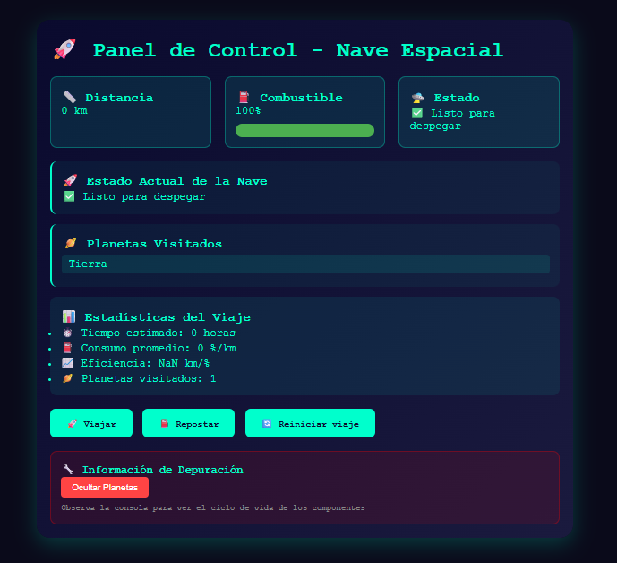

# 🚀 Panel de Control - Nave Espacial

## 📋 Descripción del Proyecto

**Panel de Control - Nave Espacial** es una aplicación interactiva desarrollada en React que simula el viaje de un explorador espacial a través del universo. Este proyecto fue diseñado específicamente para comprender y practicar los conceptos fundamentales del ciclo de vida de los componentes en React, utilizando hooks modernos como `useState`, `useEffect` y `useMemo`.

### 🎯 Objetivos del Proyecto

- **Comprender el ciclo de vida** de componentes funcionales en React
- **Practicar el uso de hooks** esenciales para gestión de estado y efectos secundarios
- **Optimizar rendimiento** mediante memoización con `useMemo`
- **Simular escenarios reales** de montaje, actualización y desmontaje de componentes

## ✨ Características Principales

### 🛸 Sistema de Control de Nave
- **Seguimiento de distancia** recorrida en kilómetros
- **Gestión de combustible** con consumo simulado
- **Estado dinámico** de la nave según las condiciones del viaje
- **Descubrimiento automático** de nuevos planetas cada 500 km

### 📊 Estadísticas en Tiempo Real
- Tiempo estimado de viaje
- Consumo promedio de combustible
- Eficiencia del viaje (km por % de combustible)
- Conteo de planetas visitados

### 🎮 Interacción del Usuario
- Botón **"Viajar"** para avanzar en la misión
- Botón **"Repostar"** para recargar combustible
- Botón **"Reiniciar viaje"** para comenzar de nuevo
- Control de visibilidad de componentes para probar desmontaje

### 🔍 Características Técnicas
- **Logs en consola** que muestran el ciclo de vida completo
- **Optimización de rendimiento** con `useMemo`
- **Componentes anidados** para demostrar ciclos de vida independientes
- **Simulación de operaciones costosas** y su optimización

## 🛠️ Tecnologías Utilizadas

- **React 18+** - Framework principal
- **React Hooks** - `useState`, `useEffect`, `useMemo`
- **Vite** o **Create React App** - Bundler y entorno de desarrollo
- **CSS Moderno** - Estilos con efectos visuales y animaciones
- **JavaScript ES6+** - Código moderno y funcional

